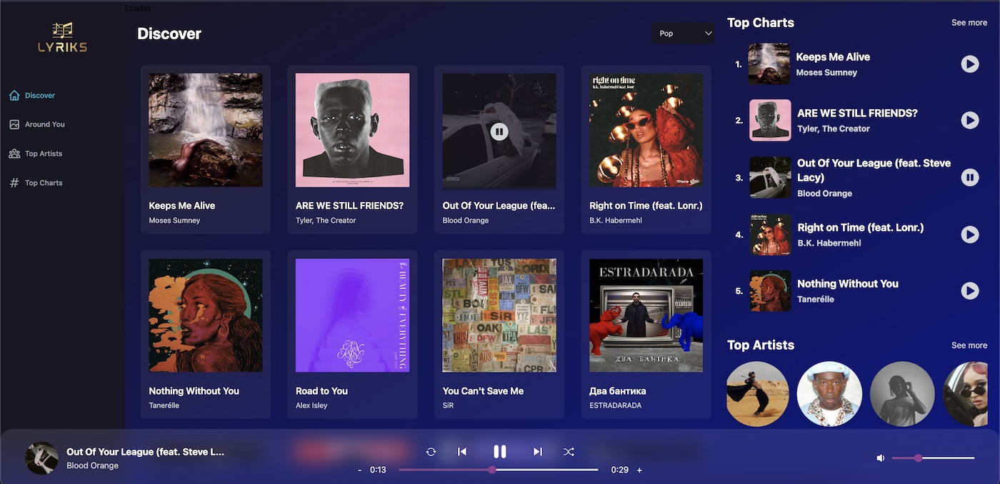

### Lyriks
A music app made with React and Tailwind. It uses redux toolkit and Shazam API, to show artists and songs. It also implements, the clasic music players controls: next, previous, pause, play, etc.


### 📦 Installation
1. clone the repository:
```
git clone https://github.com/jsonfm/lyriks-music-app.git
```
2. Install dependencies:
```
npm install
```

### ⚡️ Development
```
npm run dev
```

### ⚒️ Technologies
- React.js
- Tailwind
- Redux Toolkit
- Shazam API
- Swiper
